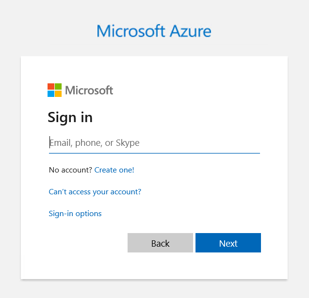
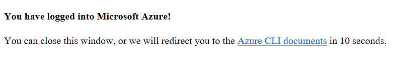
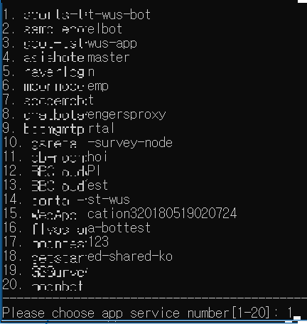
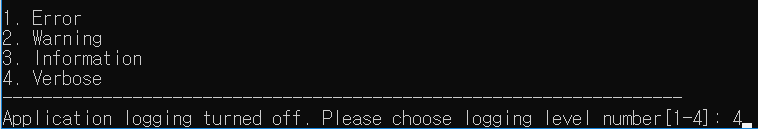

# Overview
This script is a tool that makes it easy to view the streamming logs of Azure App Service.

Support Features
- choose subscription
- choose resource group
- choose app service
- set development slot
- change logging level

# Prerequisites
Python 3.x

## Dependencies
requests==2.23.0
azure-cli-core==2.4.0
azure-cli==2.4.0


## clone
```
git clone https://github.com/dotnetpower/azure_appservice_logviewer.git
cd azure_appservice_logviewer
```

## Install Dependencies
```
pip install -r requirements.txt
```

## Run
```
python logviewer.py

```

## Steps
1. Login


2. Close Browser


3. select subscription


4. select app service


5. select log level


6. connecting


```
Enjoy debugging~
```

